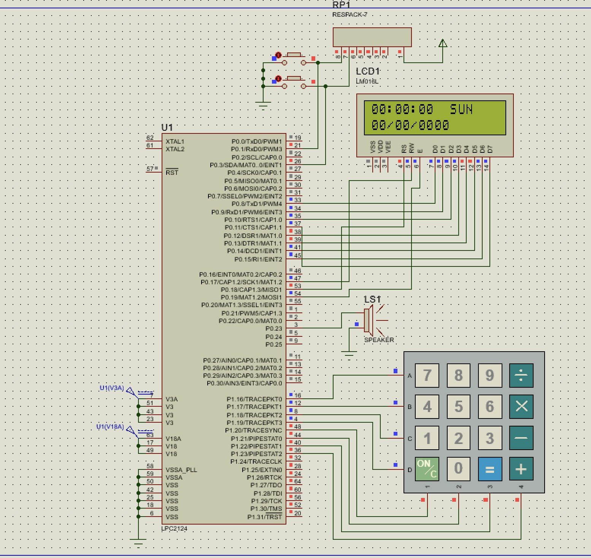

# user-configurable-medicine-reminder
ARM7-based system using LPC2148 for patient medication tracking. Features RTC-synced alerts, a 16x2 LCD for time display, and a 4x4 keypad for user configuration. Includes EINT0 for setup and EINT1 for alarm acknowledgment with a 1-minute safety timeout. Developed with Embedded C and Keil.

